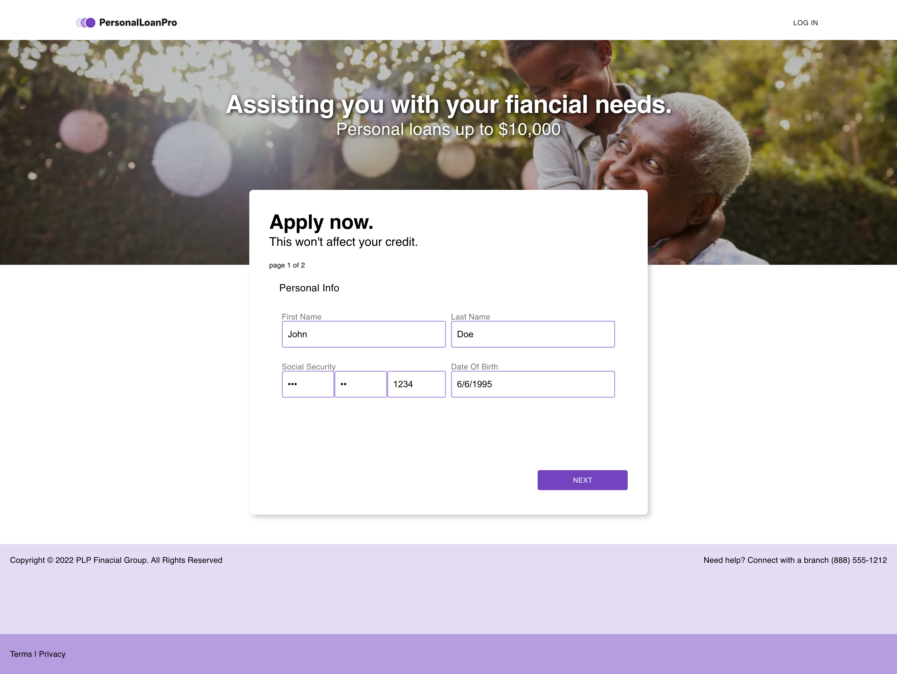

# About Simple Loan Application

The goal was to create a simple website that supports an extremely simple loan application.
Based on user input, the result will yeild in either a Small/Large Loan (hard coded) that the user can accept or deny, or a denial

## Getting Started

This project was bootstrapped with [Create React App](https://github.com/facebook/create-react-app).

## Available Scripts

In the project directory, you can either run:

### `npm start` or `yarn start`

Runs the app in the development mode.\
Open [http://localhost:3000](http://localhost:3000) to view it in your browser.

You may also see any lint errors in the console.

